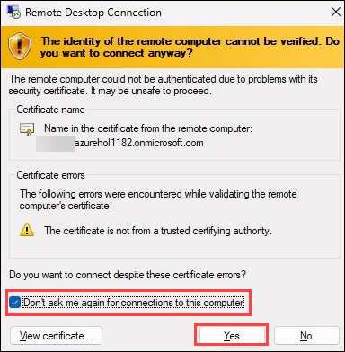

# **User Guide: The Secure Research Environment**

1. Once you launch the lab, a virtual machine (JumpVM) on the left and lab guide on the right will get loaded in your browser. Use this virtual machine throughout the workshop to perform the lab.	

   	

2. You will have the **Environment Details** tab located next to the *Lab Guide* tab that will provide you details such as Username, Password for your user.

   

 
3. You will also have **Help** tab in which we have listed known issues such as Unable to copy paste, Need credentials and much more. In case if you face any of these issues, you can troubleshoot it by following the instructions given there.
 

   


**What is the Azure Secure Enclave for Research?**

The Secure Enclave for Research (also known as the Secure Research Enclave) is a reference architecture for a remotely-accessible environment for researchers to use in a secure manner while working on restricted data sets. The solution features robust mechanisms for control over user access to the environment and also over movement of data in or out of scope for analysis so it is ideal for working with restricted data sets. Data in the environment can be analyzed with traditional VMs using Windows or Linux with well-known tools such as R Studio and also supports the use of advanced analytical tools such as Azure Machine Learning.

The solution is built using multiple Azure services including Azure Virtual Desktop to provide strong control over data movement into and out of the environment in order to prevent unauthorized exfiltraction of data sets.

In this Demo Lab we are going to work with a smaple Secure Research Environment and go over the deployment configurations used in this Lab.

Before we begin, Lets go over the architecture of this Demo Lab.

This architecture shows a secure research environment intended to allow researchers to access sensitive data under a higher level of control and data protection. This article is applicable for organizations that are bound by regulatory compliance or other strict security requirements.


# **Demo 1: Accessing secure data from the DSVM through Azure Virtual Desktop**

## **Task 1: Access the Published DSVM Remote Desktop using Browser**

In this demo, we will access the "Remote Desktop Connection" RemoteApp to connect to the Data Science Virtual Machine (DSVM).

1. Open the below URL for Remote Desktop Web Client in a new browser tab on the JumpVM or your computer. 
      
      ```
      https://aka.ms/avdwebarm
      ```


2. Enter the credentials as below:

   - Enter the username **<inject key="azureaduseremail" />** and click **Next**.   

      
   
   - Enter the password **<inject key="azureaduserpassword" />** and click **Sign in**.
   
   

   - If you see the pop-up Action Required, keep default and then click on Ask later. If you see the pop-up Help us protect your account, click on Skip for now(14 days until this is required), and then click on Next.
   >**Note:** ou may see this pop-up multiple times, please proceed to click on **Ask Later**
   >
   
   - First-time users are often prompted to Stay Signed In, if you see this pop-up, click on No.
   
   


3. The RemoteApps and the Workspace published to the logged in user will show up, click on **Remote Desktop Connection** application to access it.
   This will launch a Remote Desktop Connection Client that we will use to remotely connect to the Data Science Virtual Machine (DSVM).

   
      
4. Select **Allow** on the prompt asking permission to *Access local resources*.

   
   
5. Enter the credentials.

   - Enter the username **<inject key="azureaduseremail" />**
   - Enter the password **<inject key="azureaduserpassword" />** and click **Submit**

   

6. On the next pop-up, Enter the credentials again and select the check box next to **Remember me**. This will avoid any future prompts.

   - Enter the password **<inject key="azureaduserpassword" />**

   

7. On the next pop-up, select the check box next to **Don't ask me again for connections to this computer** and Click **Yes**. This will avoid any future prompts.

   

8. Once signed in, the Remote Desktop Client will open. You are now connected to the Desktop of the DSVM.

   

>**More Information:**
>In this task, you have accessed the Remote Desktop Client which is being hosted from the Azure Virtual Desktop.
>The Remote Desktop Client is then further connected to the DSVM, which is hosted as an independant VM on a seperate protected Virtual Network in Azure.
>Azure Virtual Desktop in this case is acting as a Jump box to get into the DSVM.
>We are going to use this DSVM to access the tools and data is only accessible from this secured VM.


## **Task 2: Access the Sample data from restricted Azure Storage Account**

In this demo, we will access a sample data that is being stored on a secured Azure storage account. We will be using Azure Storage Explorer that is already installed on the DSVM.


1. From the DSVM, Launch the Azure Storage Explorer from the task bar as shown below:

   

2. Click **Attach to a resource** once the Azure Storage Explorer is launched.

   

3. On the next window, under "Select Resource", Click **Storage account or service**.

   

4. On the next window, under "How will you connect to the storage account?", Select **Connection string (Key or SAS)** and click **Next**.

   

5. On the next window, under "Connection string", copy and paste the below string and click **Next**.
>**Note:** The "Display name" will automatically fill once you paste the below string.

      ```
     DefaultEndpointsProtocol=https;AccountName=aserstorageaccount;AccountKey=/8plNROMAsna6alYi9wT7XACvoLR5vvyC6y9lPIUSP2+6NHSRPY6mKBNOj0Pk6bXh0STOUvovJ/0+AStbEUQ9g==;EndpointSuffix=core.windows.net
      ```

   
      

6. On the next screen click on **Connect**.

   

7. Once the connection is made, you will see the **aserstorageaccount (Key)** being added to the list. 

   

8. You can now expand the **aserstorageaccount** > **Blob Containers** > **aserdata** and Download the sample data by clicking on the **Download All...** as shown in the screenshot   below. You can save the data anywhere on the C: drive. 

   

>**More Information:**
>In this task, you have accessed the sample data which can be downloaded locally to perform any actions for research.
>There are no further steps required.
>Next, we will try to access this same data from anyother VM which should result in an inability to access the data because the data is only supposed to be accessible from the DSVM and no where else.

## **Task 3: Try to access the Sample data from VM (non-DSVM negative test)**

1. Minimize the web browser in the VM as shown below:

   

2. Now click on the **Search Icon** and search for **Microsoft Azure Storage Explorer**. Launch the Azure Storage Explorer.

   

7. Click **Attach to a resource** once the Azure Storage Explorer is launched.

   

8. On the next window, under "Select Resource", Click **Storage account or service**.

   

9. On the next window, under "How will you connect to the storage account?", Select **Connection string (Key or SAS)** and click **Next**.

   

10. On the next window, under "Connection string", copy and paste the below string and click **Next**.
>**Note:** The "Display name" will automatically fill once you paste the below string.

      ```
     DefaultEndpointsProtocol=https;AccountName=aserstorageaccount;AccountKey=/8plNROMAsna6alYi9wT7XACvoLR5vvyC6y9lPIUSP2+6NHSRPY6mKBNOj0Pk6bXh0STOUvovJ/0+AStbEUQ9g==;EndpointSuffix=core.windows.net
      ```

   
      

11. On the next screen click on **Connect**.

   

12. Now you will see the **aserstorageaccount (Key)** being added to the list. 

   

13. You can now expand the **aserstorageaccount** > **Blob Containers**. However you will notice that the connection is denied. 

   

>**More Information:**
>In this task, you tried to access the same sample data that was accessible from the DSVM / DSVM Virtual Network, However because of the restrictions on the Azure Virtual Network, the access was denied.
>This validates that access to the secure data can be restricted to a specific Virtual Network or a specific VM.
