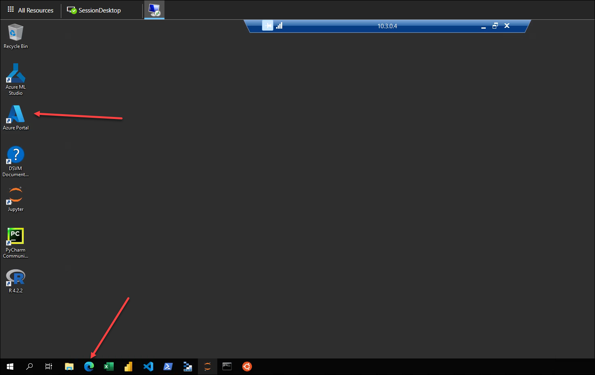
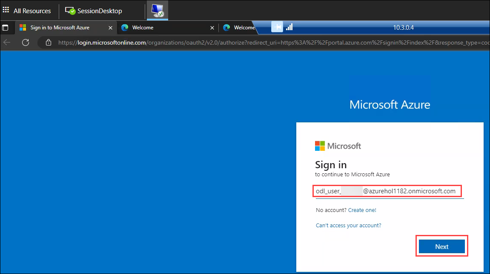
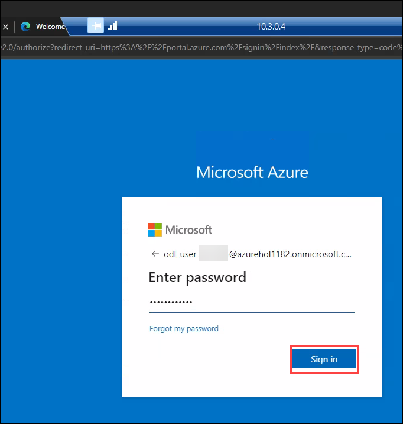
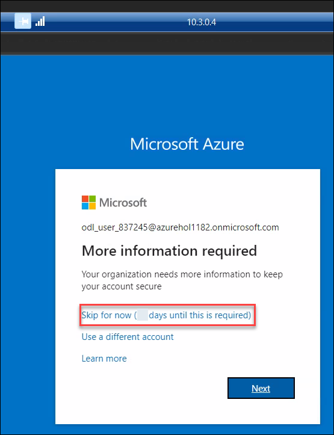
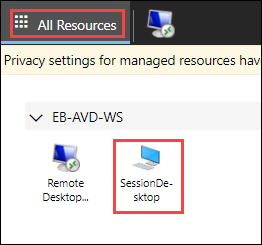
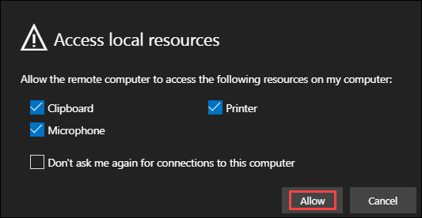
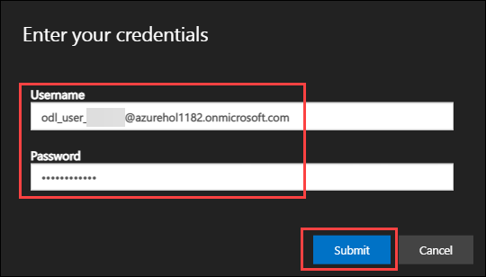
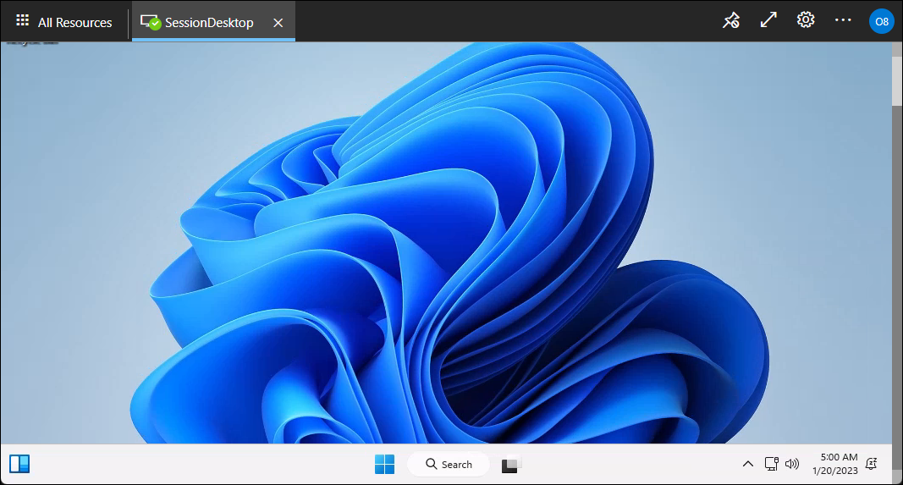
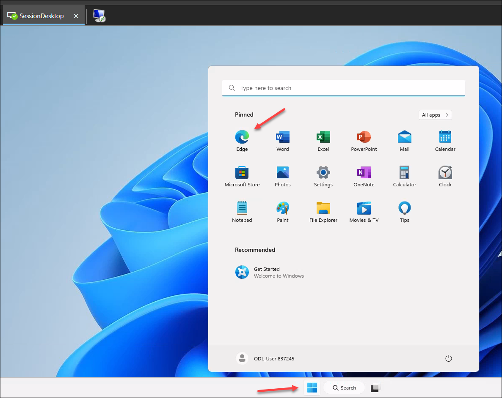
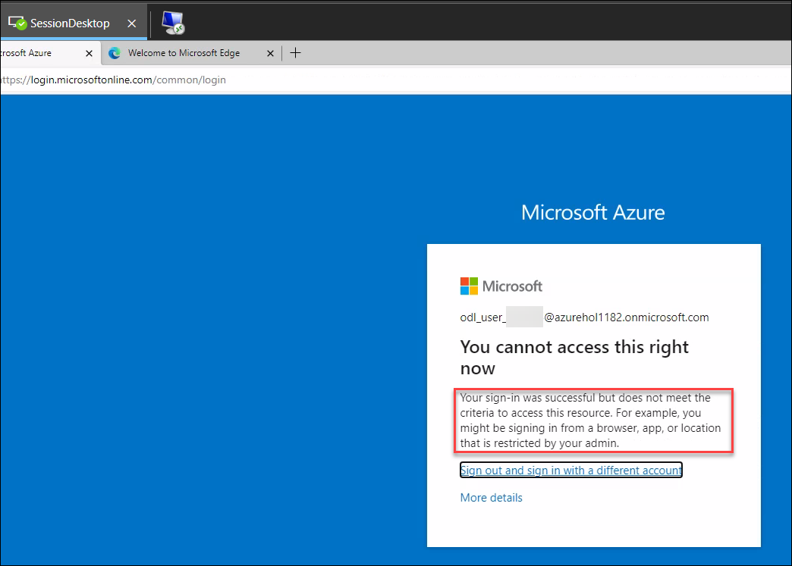

# **Demo 2: Accessing Azure Portal from DSVM**


## **Task 1: Access the Azure Portal from DSVM**

>**More Information:**
>In this task, We will first access the Azure Management Portal from the DSVM. Using the Azure Active Directory Conditional access policy, the access to the Azure portal is only allowed from the DSVM.
>Later we will try to access the same Azure Portal from the AVD Session Host and find that it is being blocked.

1. Connect to the Desktop of the DSVM if not already connected.

2. Launch Edge browser and navigate to Azure Portal using following URL. You can either use the Shortcut on the desktop or the Edge icon on the taskbar:     
```
https://portal.azure.com
```
				

3. Sign in into the portal using the below credentials.
- Username:
```
odl_user_837245@azurehol1182.onmicrosoft.com
```
	

- Password: **<inject key="Demo Admin Password" />**



4. Select **Skip for now (14 days until this is required)**.



5. You will now be logged into the Azure Management Portal.

>**More Information:**
>This validates that we can access the Azure Portal from the DSVM.
>We will return to the Azure Management Portal later for reviewing the Azure Deployments.
> Next, we will try to access the same Azure Portal from the AVD Session Host.

## **Task 2: Access the Azure Portal from AVD Session Host**

1. If you are not connected to the AVD Sessionhost, Navigate back to the Azure Virtual Desktop web client. Click on **All Resources** and launch **Session Desktop** as shown in the screenshot below:

   

>**More Information:**
>This will launch a Remote Desktop Connection to the Azure Virtual Desktop which is a different VM than the DSVM.
>Azure Virtual Desktop is connected to a seperate Virtual Network.

2. Click **Allow**

   

3. Enter the credentials.

   

4. On the next pop-up, Enter the credentials again and select the check box next to **Remember me**. This will avoid any future prompts.

   

5. Once signed in, the Desktop of the Azure Virtual Desktop's Session host will open. You are now connected to the Desktop of the AVD.

   

6. Launch Microsoft Edge

   

7. Navigate to Azure Portal using following URL.
```
https://portal.azure.com
```

3. Try to sign in into the portal using the below credentials.
- Username:
```
odl_user_837245@azurehol1182.onmicrosoft.com
```
- Password: **<inject key="Demo Admin Password" />**

4. Now you will notice that the Sign in was succesfull, However, due to the Conditional Access Policies in place, the Azure Portal will not launch.



>**More Information:**
>This validates that the Azure Portal can only be accessed when the connection is initiated from the designated DSVM.
>Next, lets check the Azure deployments to understand the architecture of this Lab setup.