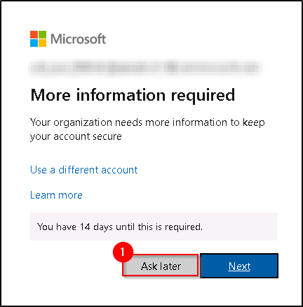

# **Demo 2: Accessing Azure Portal from DSVM**


## **Task 1: Access the Azure Portal from DSVM**

>**More Information:**
>In this task, We will first access the Azure Management Portal from the DSVM. Using the Azure Active Directory Conditional access policy, the access to the Azure portal is only allowed from the DSVM.
>Later we will try to access the same Azure Portal from the AVD Session Host and find that it is being blocked.

1. Connect to the Desktop of the DSVM if not already connected.

2. Launch Edge browser and navigate to Azure Portal using following URL. You can either use the Shortcut on the desktop or the Edge icon on the taskbar:     
```
https://portal.azure.com
```

				

3. Sign in into the portal using the below credentials.

   - Enter the username **<inject key="azureaduseremail" />** and click **Next**.   

	

   - Enter the password **<inject key="azureaduserpassword" />** and click **Sign in**.


4. If you see the pop-up Action Required, keep default and then click on Ask later. If you see the pop-up Help us protect your account, click on Skip for now(14 days until this is required), and then click on Next.
**Note:** You may see this pop-up multiple times, please proceed to click on Ask Later



5. First-time users are often prompted to Stay Signed In, if you see this pop-up, click on No.


6. You will now be logged into the Azure Management Portal.

>**More Information:**
>This validates that we can access the Azure Portal from the DSVM.
>We will return to the Azure Management Portal later for reviewing the Azure Deployments.
> Next, we will try to access the same Azure Portal from the AVD Session Host.

## **Task 2: Access the Azure Portal from VM**

1. Minimize the web browser in the VM as shown below::

   

2. Click on Azure Portal as shown below:

   

3. Try to sign in into the portal using the below credentials.

   - Enter the username **<inject key="azureaduseremail" />**
   - Enter the password **<inject key="azureaduserpassword" />**

4. Now you will notice that the Sign in was succesfull, However, due to the Conditional Access Policies in place, the Azure Portal will not launch.


>**More Information:**
>This validates that the Azure Portal can only be accessed when the connection is initiated from the designated DSVM.
>Next, lets check the Azure deployments to understand the architecture of this Lab setup.
