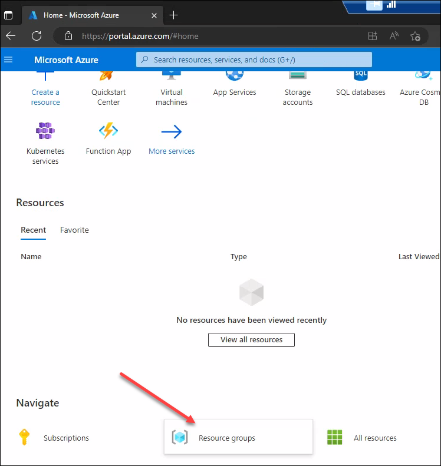
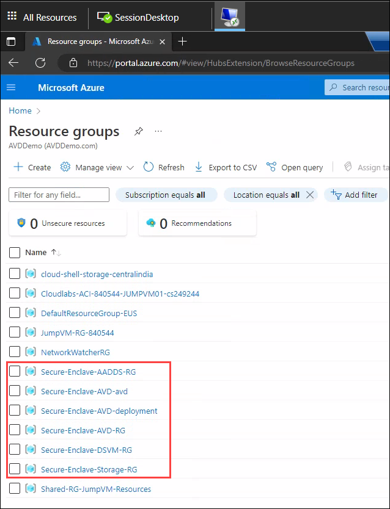
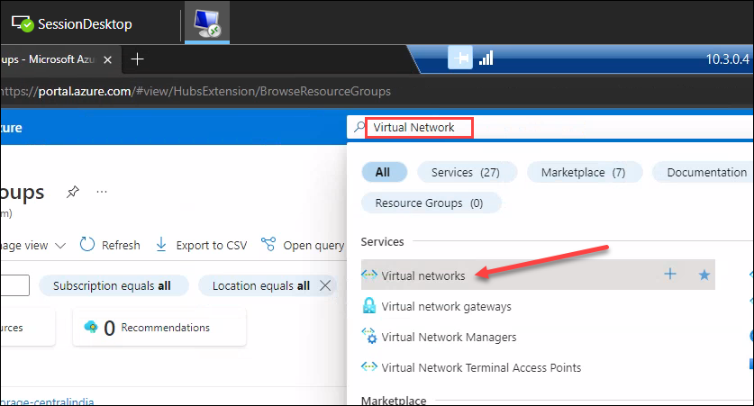
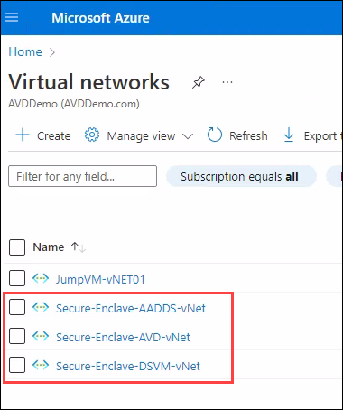
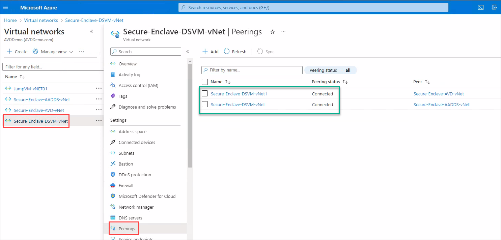
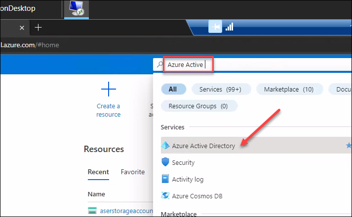
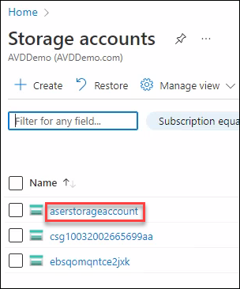

# **Demo 3: General walk through of Azure Resources (Demo)**

## **Networking and Azure Active Directory Domain Services overview**

>**More Information:**
>In this demo, we will walk through the Azure networking and Active Directory Domain Services setup.

1. Connect to the Desktop of the DSVM if not already connected.

2. Launch Edge browser and navigate to Azure Portal using following URL. You can either use the Shortcut on the desktop or the Edge icon on the taskbar:     
```
https://portal.azure.com
```
				

3. Sign in into the portal using the below credentials.
- Username:
```
odl_user_837245@azurehol1182.onmicrosoft.com
```
	

- Password: **<inject key="Demo Admin Password" />**


4. Select **Skip for now (14 days until this is required)**.


5. You will now be logged into the Azure Management Portal.

6. Click on **Resource groups** as shown in the below screenshot:



7. Here you will see the Resource Groups that have been created to deploy the Secure Research Environment.



8. The workloads are devided as per the below list:
   - Secure-Enclave-AADDS-RG
      This RG contains the Azure Active Directory Domain Services to support Identity and Authentication.

   - Secure-Enclave-AVD-avd
      This RG contains the Azure Virtual Desktop resources.

   - Secure-Enclave-AVD-deployment
      This RG contains the Azure Virtual Desktop deployment Automation scripts.

   - Secure-Enclave-AVD-RG
      This RG contains the Azure Virtual Desktop Virtual Network.

   - Secure-Enclave-DSVM-RG
      This RG contains the DSVM and it's Network.

   - Secure-Enclave-Storage-RG
      This RG contains the Secured data in an Azure Storage Account.

9. Next, Search for Virtual Networks in Azure Portal's search bar:



10. Here, you will see the Virtual Networks created for this Secure Research Environment.



11. The workloads are devided as per the below list:
   - Secure-Enclave-AADDS-vNet
      This vNet contains the Azure Active Directory Domain Services to support Identity and Authentication.

   - Secure-Enclave-AVD-vNet
      This vNet contains the Azure Virtual Desktop Session Hosts.
   
   - Secure-Enclave-DSVM-vNet
      This vNet contains the DSVM.

12. Click on **Secure-Enclave-DSVM-vNet** > **Peerings**. Here you will find the vNet peerings that have been setup so that all the Virtual Networks can communicate with each other.



13. Next, Search for **Storage** in Azure Portal search:



14. Click on **aserstorageaccount**

