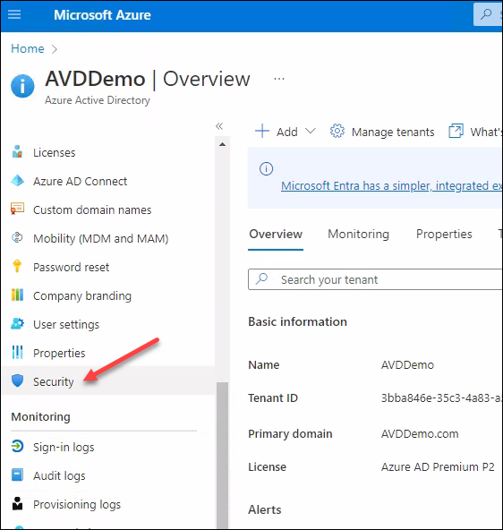
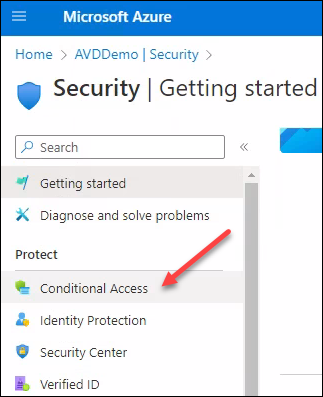
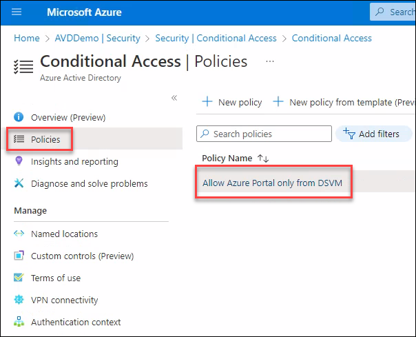
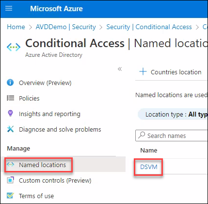
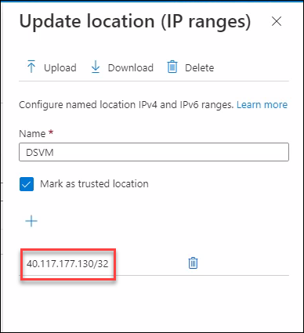
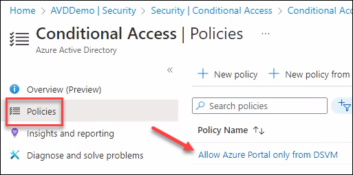
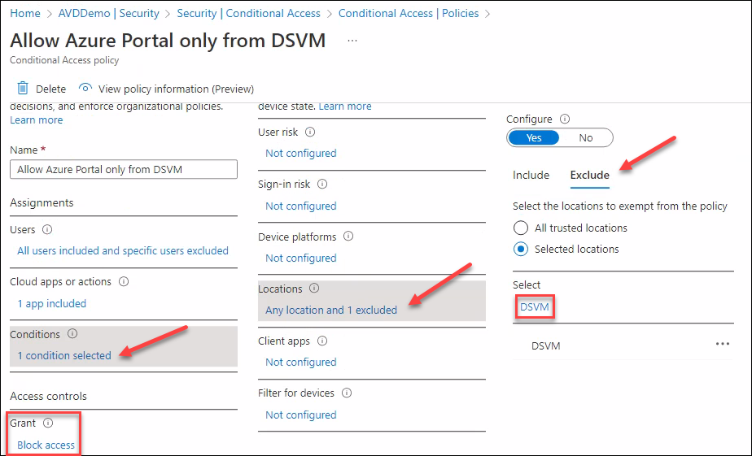
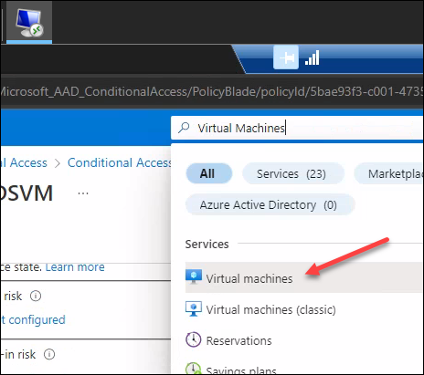
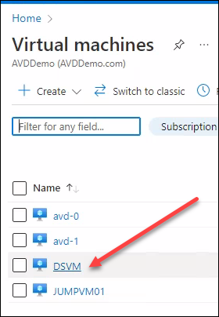
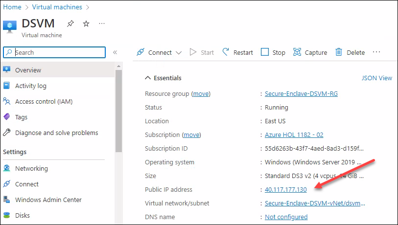

# **Demo 3: General walk through of Azure Resources (Demo)**

>**More Information:**
>In this demo, we will walk through the Azure resources that are setup for this Secure Research Environment.

1. Connect to the Desktop of the DSVM if not already connected.

2. Launch Edge browser and navigate to Azure Portal using following URL. You can either use the Shortcut on the desktop or the Edge icon on the taskbar:     
```
https://portal.azure.com
```
				

3. Sign in into the portal using the below credentials.

   - Enter the username **<inject key="azureaduseremail" />**

	

   - Enter the password **<inject key="azureaduserpassword" />**


4. Select **Skip for now (14 days until this is required)**.


5. You will now be logged into the Azure Management Portal.

6. Click on **Resource groups** as shown in the below screenshot:


7. Here you will see the Resource Groups that have been created to deploy the Secure Research Environment.


8. The workloads are devided as per the below list:
   - **Secure-Enclave-AADDS-RG**
      This RG contains the Azure Active Directory Domain Services to support Identity and Authentication.

   - **Secure-Enclave-AVD-avd**
      This RG contains the Azure Virtual Desktop resources.

   - **Secure-Enclave-AVD-deployment**
      This RG contains the Azure Virtual Desktop deployment Automation scripts.

   - **Secure-Enclave-AVD-RG**
      This RG contains the Azure Virtual Desktop Virtual Network.

   - **Secure-Enclave-DSVM-RG**
      This RG contains the DSVM and it's Network.

   - **Secure-Enclave-Storage-RG**
      This RG contains the Secured data in an Azure Storage Account.

9. Next, Search for Virtual Networks in Azure Portal's search bar:


10. Here, you will see the Virtual Networks created for this Secure Research Environment.


11. The workloads are devided as per the below list:
   - **Secure-Enclave-AADDS-vNet**
      This vNet contains the Azure Active Directory Domain Services to support Identity and Authentication.

   - **Secure-Enclave-AVD-vNet**
      This vNet contains the Azure Virtual Desktop Session Hosts.
   
   - **Secure-Enclave-DSVM-vNet**
      This vNet contains the DSVM.

12. Click on **Secure-Enclave-DSVM-vNet** > **Peerings**. Here you will find the vNet peerings that have been setup so that all the Virtual Networks can communicate with each other.


13. Next, Search for **Azure Active Directory** in Azure Portal search and navigate to it.


14. Click on **Security**



15. Under Security, Click on **Conditional Access**



16. Here you will find the Policy that was setup to allow Azure Portal Access only from the DSVM.



17. For the blocking control to work, the DSVM has been assigned a static Public IP that is used for Outbound Internet. The same Public IP is being used in the Conditional Access Policy. Lets review how it is configured.

   - Click on **Named locations**  and select **DSVM** to find out which Public IP is added as trusted location.
   
   

   - Here you will notice the IP addresses that is being added.
   
   

18. Next, Lets check the Conditional Access Policy and it's Configurations.

   - Select **Allow Azure Portal only from DSVM** policy
   
   

   - Select **1 condition selected** under **Conditions**, Here you will notice that under **Locations**, **Any location** is *Included* but the **DSVM** named location is *Excluded*. The Grant Control is set as "Block access". This policy ensures that Any Inbound access request is blocked unless it is coming from the DSVM's Public IP.
   
   

19. Next, lets look at the DSVM and confirm what Public IP it is using

   - Search and launch **Virtual Machines** from the Azure Portal's search bar 
   
   

   - Click on the **DSVM**

   

   - Notice the Public IP address for the DSVM

   

>**More Information:**
>In this walkthrough, we have explored the basics of how this Secure reasearch Environment is setup.