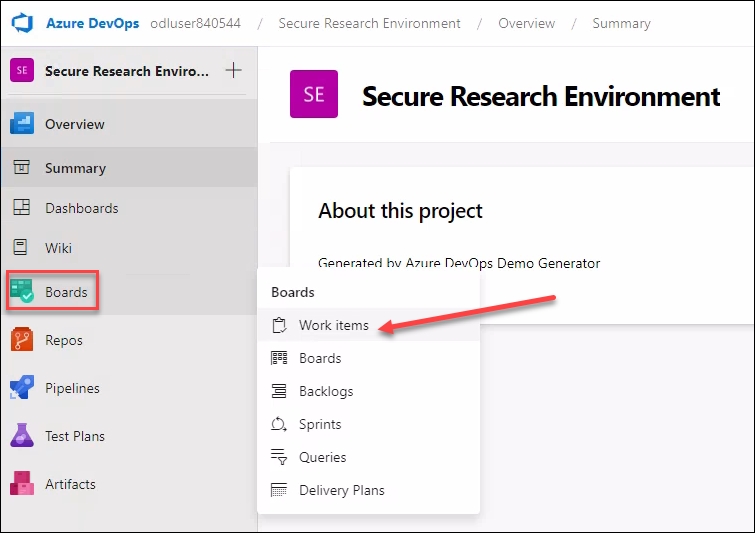

# **Demo 4: Refer to the "Secure Research" Azure DevOps Generator template**

To help you with the process of deploying research environments, refer to the "Secure Research" Azure DevOps Generator template. This Azure DevOps template contains Azure Boards work items to guide you through the design decisions and deployment of a complete research environment.

## **Task 1: Access the "Secure Research" Azure DevOps Generator template**

1. Navigate back to the DSVM, from Edge browser, navigate to the below URL and click on **Sign In**
```
https://go.microsoft.com/fwlink/?LinkId=307137
```

2. For signing in, You can either use the account provided in this lab or you can use your own Microsoft 365 / Azure AD user account.

3. Enter the Username for the ODL User (Lab User)


4. Enter the password and **Sign In**


>**Note:** If there's a dialog box with *More information required*, select **Skip for now option**.
>

5. On the next screen, Enter the Captcha and Click **Continue**


This should create the required Azure DevOps Organization for you.

6. In the same Browser tab, copy and paste the below URL
```
https://azuredevopsdemogenerator.azurewebsites.net/?name=secresearch
```
7. On the next screen, Enter the **New Project Name** and Select the Organization, Click **Create Project**.


8. Wait for the Project to be created. Once done, Click on the **Navigate to project**


9. Hover over the **Boards** and then select **Work items**



10. Here you can go through the Work items that can be used as a template for Secure Research Environment Setup.

